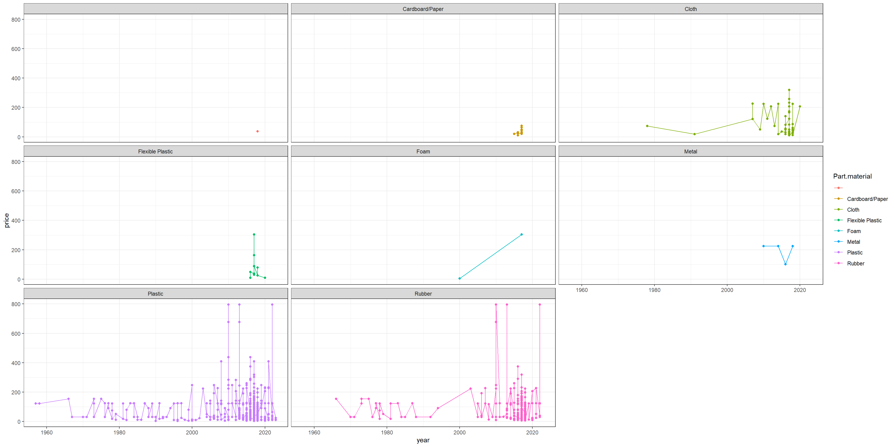
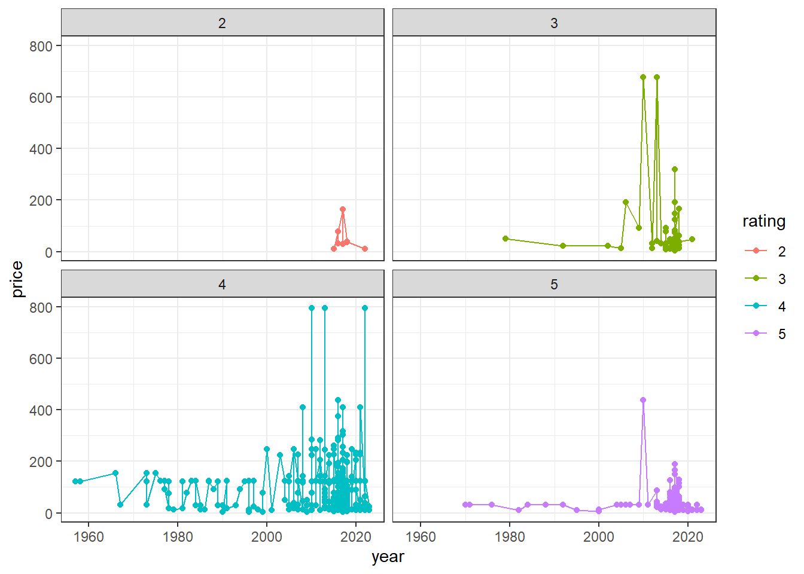

## Background

Lego is a company that creates sets of plastics creations that can be snapped together to make new and extraordinary things. These different sets have different varieties going from Star Wars to Indiana Jones, Avengers, Disney, etc. There's so many different sets that Lego looks endless. This spark in creativity has made Lego a very profitable business. So much so, that Lego can change the prices of their sets. We are here to explore that change in prices over time.
This is the link:
https://www.kaggle.com/datasets/alessiasimone/lego-sets-and-price-1955-2023/

## Data Wrangling


::: {.cell}

:::

::: {.cell}

```{.r .cell-code}
# Use this R-Chunk to import data.
first = read.csv("Output.csv", sep = ";")
```
:::

::: {.cell}

```{.r .cell-code}
# Use this R-Chunk to clean & wrangle your data.
second = select(mutate(first, price = as.double(gsub(",", ".", first$Set.Price))), year, price, Part.material, Star.rating)

third = filter(mutate(second, rating = stri_sub(second$Star.rating, 1, 1)), Part.material == "Plastic")
```
:::


## Data Visualization


::: {.cell}

```{.r .cell-code}
# Use this R-Chunk to plot & visualize your data.
ggplot(second, aes(x=year, y=price, col = Part.material)) +
  geom_point() +
  geom_line() +
  facet_wrap(~ Part.material)+
  theme_bw()
```

::: {.cell-output-display}
{width=1920}
:::
:::

::: {.cell}

```{.r .cell-code}
ggplot(third, aes(x=year, y=price, col = rating)) +
  geom_point() +
  geom_line() +
  facet_wrap(~ rating)+
  theme_bw()
```

::: {.cell-output-display}
{width=672}
:::
:::


## Conclusions

From the created chart we can see that almost every material that has more than two instances starts to fluctuate, go up and down. It starts to fluctuate almost immediately. With the materials with the bigger amount of data: plastic, rubber, and cloth, there starts to show up outliers in the data. At first the data was fluctuating almost constantly in price. But over time the fluctuation began to rise. So, not only did Lego get more expensive in price, but Lego also became more popular. The best explanation I can come up for this is nostalgia, because I'm not buying something as expensive as Lego nowadays.
From further research, It looks as if the plastics that look almost the best (rating: 4) are also priced higher than those that are rated the best (rating: 5). This means that higher price doesn't always mean it'll be a good Lego set. This gives further evidence, however, that the price has risen over time.